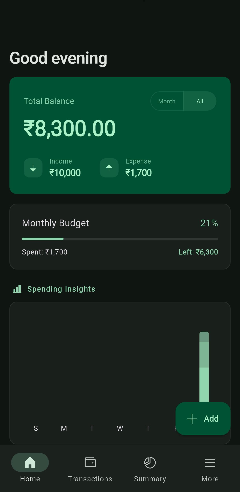
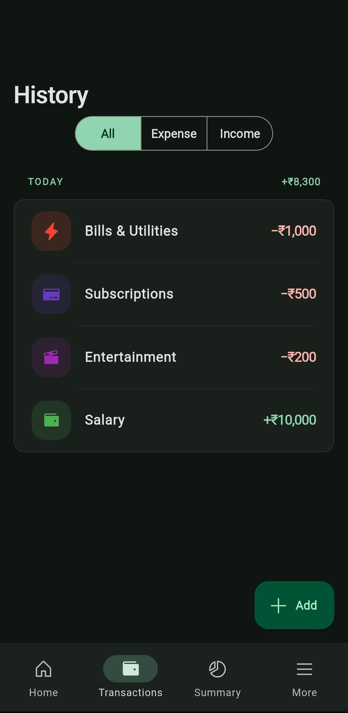
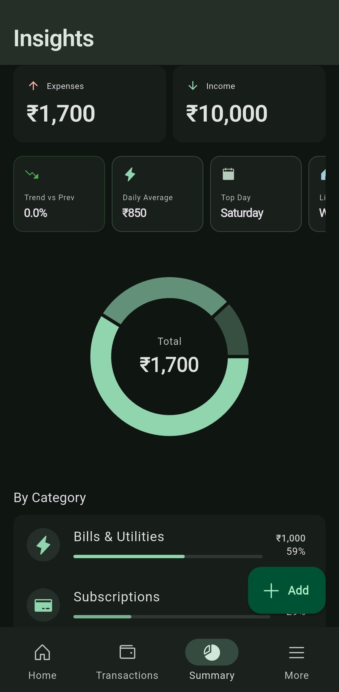
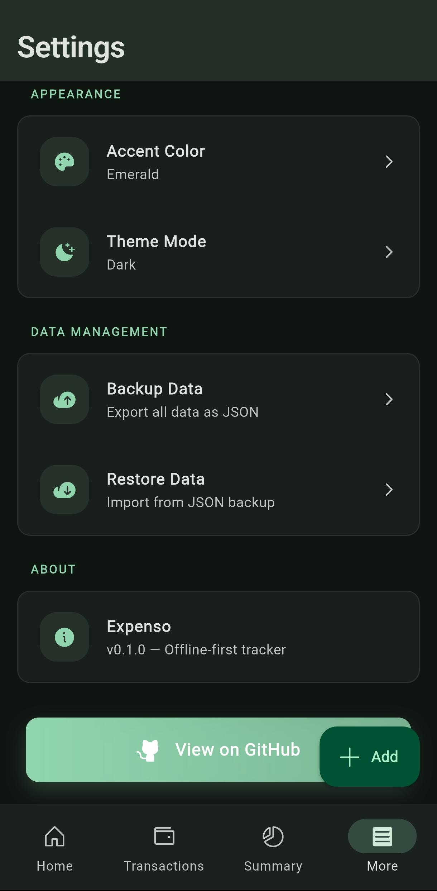

# Expenso

Expenso is a professional, offline-first expense tracking application built with Flutter. Designed with privacy and performance at its core, Expenso provides a seamless experience for managing personal finances without requiring an internet connection or external account.

## Description

Expenso offers a clean, premium interface for users to monitor their spending habits, manage income, and gain deep insights into their financial health. By leveraging a local-first architecture, the application ensures that all sensitive financial data remains exclusively on the user's device. The UI follows modern design principles with smooth micro-animations, edge-to-edge support, and a highly responsive layout.

## Features

*   **Offline-First Architecture**: Utilizes Hive for high-performance, local data persistence. Your data never leaves your device.
*   **Dynamic Dashboard**: Real-time overview of total balance, monthly budget progress, and daily spending trends.
*   **Comprehensive Transaction History**: Categorized list of income and expenses with advanced filtering capabilities.
*   **Deep Insights**: Interactive charts and category-wise breakdowns to visualize spending patterns.
*   **Customizable Theme**: Support for system dark/light modes and multiple premium accent color presets.
*   **Data Security & Portability**: Built-in functionality to export and import data as JSON for manual backups and migrations.
*   **Premium UX**: Implements micro-animations, haptic feedback, and edge-to-edge system UI integration for a polished feel.

## Screenshots

| Dashboard | History | Insights | Settings |
| :---: | :---: | :---: | :---: |
|  |  |  |  |

## Tech Stack

*   **Framework**: Flutter (Dart)
*   **State Management**: Riverpod
*   **Local Database**: Hive & Hive Flutter
*   **Navigation**: GoRouter (Declarative Routing)
*   **Visualization**: FL Chart
*   **Animations**: Flutter Animate & Animations Package
*   **Typography**: Google Fonts
*   **Icons**: Phosphor Icons

## Installation & Setup

### Prerequisites

*   Flutter SDK (^3.10.8)
*   Android Studio / Xcode (for mobile development)
*   Java Development Kit (JDK 17)

### Steps

1.  Clone the repository:
    ```bash
    git clone https://github.com/Pranit-DC/Expenso.git
    ```

2.  Navigate to the project directory:
    ```bash
    cd Expenso
    ```

3.  Install dependencies:
    ```bash
    flutter pub get
    ```

4.  Generate required code (for Hive adapters):
    ```bash
    flutter pub run build_runner build --delete-conflicting-outputs
    ```

## Running the App

To run the application in debug mode on a connected device or emulator:

```bash
flutter run
```

## Build APK

To generate a production-ready Android APK:

```bash
flutter build apk --release
```

The output APK will be located at:
`build/app/outputs/flutter-apk/app-release.apk`

## Download APK

You can download the latest stable release from the [GitHub Releases](https://github.com/Pranit-DC/Expenso/releases) page.

## Project Structure

```text
lib/
├── core/
│   ├── database/    # Hive configuration, adapters, and services
│   ├── routing/     # GoRouter implementation and navigation logic
│   ├── theme/       # AppTheme definitions and theme providers
│   ├── utils/       # Shared helpers and formatters
│   └── widgets/     # Common UI components (buttons, cards, etc.)
├── features/
│   ├── dashboard/   # Main summary and balance tracking
│   ├── insights/    # Statistical analysis and charts
│   ├── settings/    # App configuration and data management
│   └── transactions/ # Transaction logging and history
└── main.dart        # App entry point and initialization
```

## Key Functional Modules

### Dashboard Module
The central hub of the application. It computes real-time balance by aggregating income and expense streams. It also features a budget tracker that calculates the percentage of monthly allowance spent.

### Transaction Management
A robust system for recording financial entries. Each transaction includes a type (Income/Expense), category, amount, timestamp, and optional notes.

### Insights Engine
Transforms raw transaction data into actionable intelligence. It uses visual charts to render a distribution of expenses by category, helping users identify where their money goes.

### Data Management
Ensures data longevity through JSON-based backup and restoration. The backup service handles the serialization of Hive boxes into a shareable file, while the restore functionality validates and imports external datasets.

## Contributing

1.  Fork the Project
2.  Create your Feature Branch (`git checkout -b feature/AmazingFeature`)
3.  Commit your Changes (`git commit -m 'Add some AmazingFeature'`)
4.  Push to the Branch (`git push origin feature/AmazingFeature`)
5.  Open a Pull Request

## License

Distributed under the MIT License. See `LICENSE` for more information.
